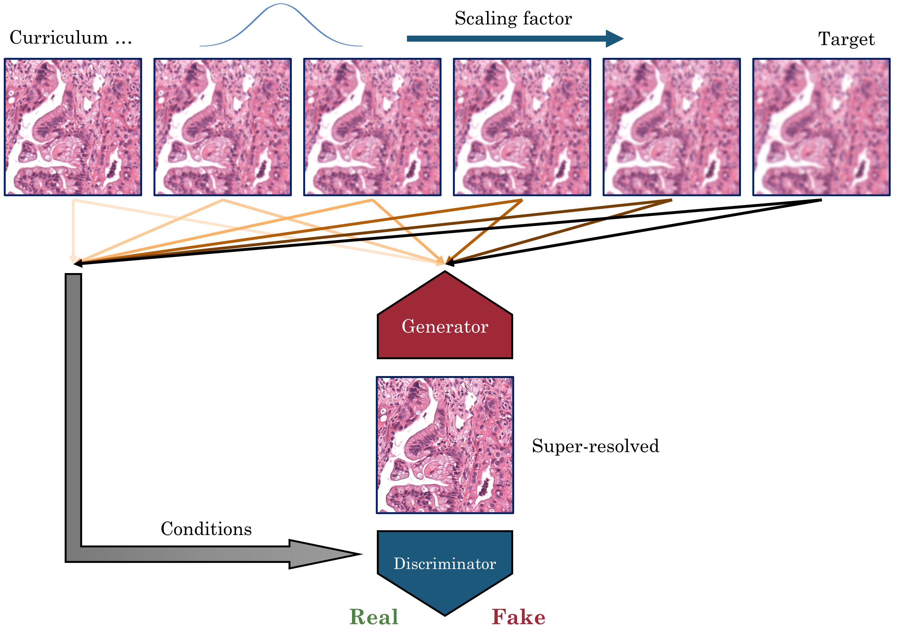

# WSISR: Single image super-resolution for whole slide image using convolutional neural networks and self-supervised color normalization  
This is the PyTorch implementation of using generative adversarial neural networks for single-image super-resolution in whole slide imaging. [Paper. *Medical Image Analysis*.](https://www.sciencedirect.com/science/article/abs/pii/S1361841520303029)

<div align="center">
  
</div>

## Installation
Install [anaconda/miniconda](https://docs.conda.io/en/latest/miniconda.html)  
Required packages
```
  $ conda env create --name wsisr --file env.yml
  $ conda activate wsisr
```

## Install PyTorch-FID
Details regarding [PyTorch-FID](https://github.com/mseitzer/pytorch-fid).  
MacOS/Linux:  
```  
  $ pip install pytorch-fid
```
Windows:  
```  
  $ pip install git+https://github.com/mseitzer/pytorch-fid.git
```
 
## Download TMA dataset and Fiji-ImageJ
```  
  $ python download.py
```
  
## Training
You will need GPU/CUDA support to run the training.  
```  
  $ python train-compress.py
```

### Arguments
```
[--batch-size]        # Size of the mini-batch                  default: (int) 32
[--patch-size]        # Size of extracted patch                 default: (int) 224
[--up-scale]          # Targeted upscale factor                 default: (float) 5
[--num-epochs]        # Number of training epochs               default: (int) 900
[--g-lr]              # Learning rate of generator              default: (float) 0.0001
[--d-lr]              # Learning rate of descriminator          default: (float) 0.00001
[--percep-weight]     # GAN loss weight                         default: (float) 0.001
[--run-from]          # Load weights from a previous run        default: None
[--start-epoch]       # Starting epoch for the curriculum       default: (int) 1
[--gan]               # Enable GAN training 1: on, 0: off       default: (int) 1
[--num-critic]        # Interval of descriminator training      default: (int) 1
```
Please check python argument help for more details.  

### Output
1. Output images: the final output testing images will be stitched ('output/lr/', 'output/hr/', 'output/sr/') when the training completes. During the training, validation patches are printed in 'output/print/'.  
2. Model weights are saved in 'weights/'. Each run will create a separate folder. Use the folder name as the argument '--run-from' will load the corresponding weights.  
3. 1/2 of the epochs are used for curriculum learning where the mean of the upscale factor increases. Starting the epoch at 1/2 of the total epoch can skip the curriculum.  
4. Patches are randomly extracted from the TMA. GAN-based training can take very long time to converge.  
  
## Citation
Please use the following BibTeX entry.  
```
@article{li2020singleimage,
	title = {Single image super-resolution for whole slide image using convolutional neural networks and self-supervised color normalization},
	issn = {13618415},
	doi = {10.1016/j.media.2020.101938},
	journal = {Medical Image Analysis},
	author = {Li, Bin and Keikhosravi, Adib and Loeffler, Agnes G. and Eliceiri, Kevin W.},
	year = {2020}
}
```
